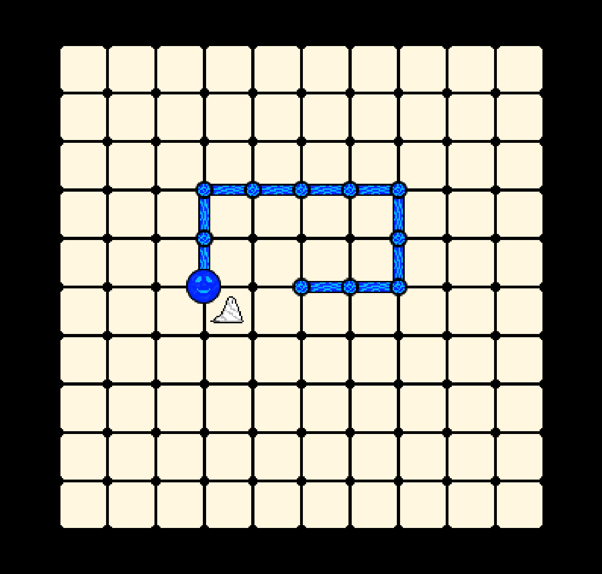

# Lizar's Lair

A 2D top-down game made with PyGame for the GMTK Game Jam 2025, with the "Loop"
theme. Given a grid with enemies, you must loop around the enemies in order to
defeat them.

### How to Play

You are Lizar the Slime, and Salt monsters are invading your Lair!
Move around the map with the WASD keys, leaving a trail of slug behind you.
Use your slug to create a loop, encasing salt monsters that are damaging your
slug and try to evade you. Creating a loop will kill all enemies inside, with
each enemy killed giving you points! You cannot loop with too much salt on the
screen, which would essentially render the game OVER.

- [itch.io page](https://d4isdavid.itch.io/lizars-lair)
- [GitHub Releases](https://github.com/D4isDAVID/LizarsLair/releases)
- [Developer's Guide](#developers-guide)
- [License](#license)

## Developer's Guide

This project uses [uv](https://docs.astral.sh/uv/) for running and building.
However, it is also possible to run the game directly with Python, explained
below.

- `uv sync` - Download the required Python version and the dependencies.
- `uv run src` - Run the game from the source code.
- `uv run ruff check` - Run the linter and formatter.
- `uv run pytest` - Run tests.
- `uv run pyinstaller ./src/__main__.py --windowed --name LizarsLair --add-data assets:assets --icon=icon.ico` - Bundle the source code into an executable.

### Running Directly With Python

This project uses Python 3.13.

- Set up a virtual environment with `python -m venv .venv`
- Activate the virtual environment with:
  - `.venv\Scripts\Activate.ps1` on Windows
  - `source .venv/bin/activate` on Linux/MacOS
- Install dependencies with `pip install -r requirements.txt`
- Run the game with `python src`

## License

Lizar's Lair's Source Code © 2025 by David Malchin is licensed under the MIT
license, provided in the [LICENSE](./LICENSE) file.

Lizar's Lair's Sound Assets by David Malchin are marked CC0 1.0 Universal.
To view a copy of this mark, visit
https://creativecommons.org/publicdomain/zero/1.0/.

Lizar's Lair's Image Assets © 2025 by Ohad Shater are licensed under Creative
Commons Attribution 4.0 International. To view a copy of this license, visit
https://creativecommons.org/licenses/by/4.0/.

